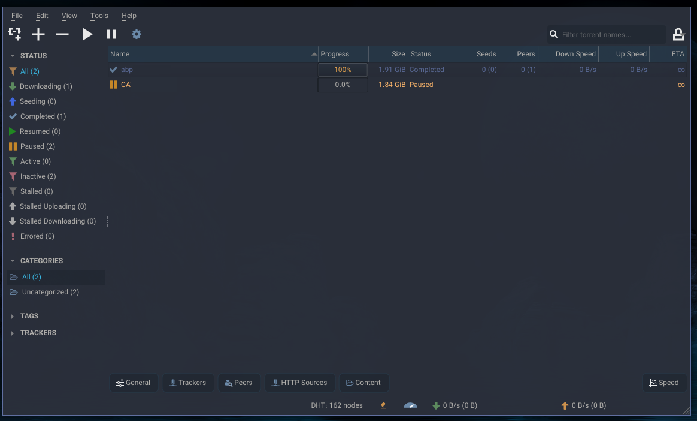
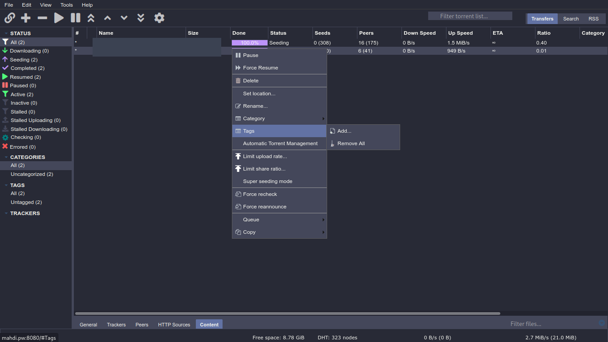

# Dracula for [QBittorrent](https://www.qbittorrent.org/)

> A dark theme for [QBittorent](https://www.qbittorrent.org/).

For more information about theme development and structure, [click here](https://github.com/MahdiMirzade/qbittorrent).

Application theme:

WebUI theme:

## Install

All instructions can be found at [draculatheme.com/qbittorrent](https://draculatheme.com/qbittorrent).

## Team

This theme is maintained by the following person(s) and a bunch of [awesome contributors](https://github.com/dracula/qbittorrent/graphs/contributors).

|  |
| ------------------------------------------------------------------------------------------------- |
| [Mahdi Mirzade](https://github.com/mahdimirzade)                                                  |

## Community

- [Twitter](https://twitter.com/draculatheme) - Best for getting updates about themes and new stuff.
- [GitHub](https://github.com/dracula/dracula-theme/discussions) - Best for asking questions and discussing issues.
- [Discord](https://draculatheme.com/discord-invite) - Best for hanging out with the community.

## License

[MIT License](./LICENSE)
