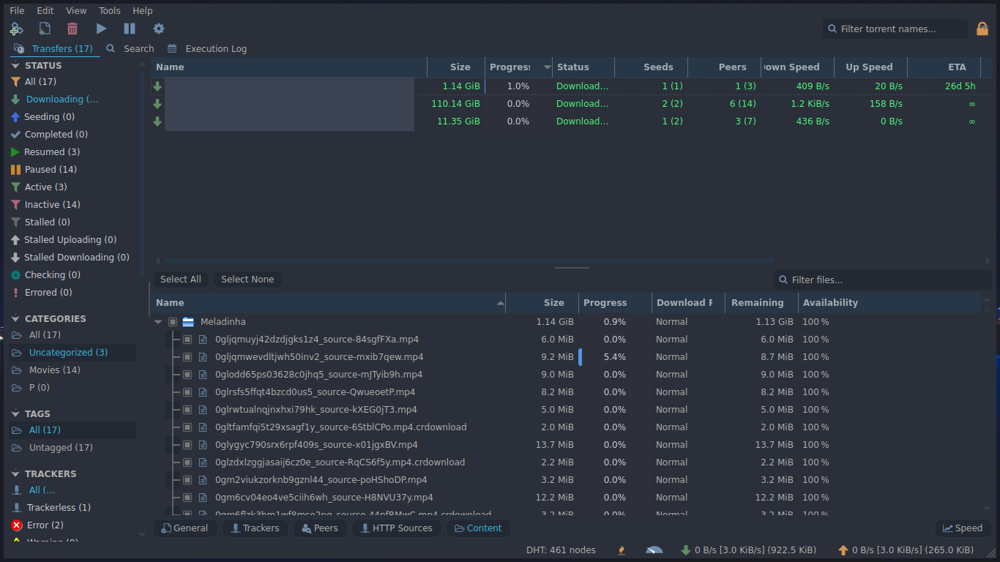

# QBittorrent Theme
[qBittorrent](https://qbittorrent.org/) is a cross-platform free and open-source BitTorrent client.

[How to create your theme? - Reference](https://github.com/qbittorrent/qBittorrent/wiki/Create-custom-themes-for-qBittorrent)

This theme is added to [qbittorrent](https://github.com/qbittorrent/qBittorrent)'s wiki page on github. [Click Here](https://github.com/qbittorrent/qBittorrent/wiki/List-of-known-qBittorrent-themes)

---

## Application Theme (Client)

### Usage
1. Enable theme selection from menu:
→ Tools → Options → Behavior → Interface → Use custom UI Theme
2. In 'UI Theme file' click on the file icon and select your '.qbtheme' file
3. Restart qbittorrent to apply theme

### Screenshots


### Development
Qbittorrent theme is orginally a single '.qbtheme' file
that you can select and use in qbittorrent preferences,
which you need to compile a '.qrc' file with [rcc](https://doc.qt.io/qt-5/rcc.html).

You can edit stylesheet.qss, config.json to start
making your very own qbittorrent theme!

My theme contains:
| Name			| Desc				|
| --------------------- | ----------------------------- |
| Icons/		| Contains GUI Icons		|
| Icons/qss/		| // //				|
| stylesheet.qss	| Full theming			|
| config.json		| Custom GUI colors		|
| resources.qrc		| Resources for compiling	|

### Compile
Compiling this theme requires [rss](https://doc.qt.io/qt-5/rcc.html).

You can install this tool with:
```
$ pacman -S qt5-base
```

Now we can generate our theme:
```
$ rcc resources.qrc -o example.qbtheme -binary
# resouces.qrc: list of the files
# example.qbtheme: name of your theme
```

### Icons
Icons are based on the `Font-Awesome` icon-set: [link](http://fontawesome.io/icons/).

If you need to add an icon that qBittorrent does not already use, you can take an icon from the SVG fork of `Font-Awesome`: [link](https://github.com/encharm/Font-Awesome-SVG-PNG).

#### Optimizing SVG

Use [svgcleaner](https://github.com/RazrFalcon/svgcleaner)

---

## WebUI Theme (Server)

### Usage

1. Clone the repository:
    ```
    cd /opt
    git clone https://github.com/dracula/qbittorrent.git
    chmod -R 777 nightwalker
    ```
2. Enable theme selection from menu: → Tools → Options → Web UI → Use alternative Web UI.
3. In 'Files locations' bar, you should type `/opt/qbittorrent/webui` .

### Screenshots


### Developement
From qBittorrent v4.1.0 and on, the WebUI architecture was expanded to allow the use of alternate sets of WebUI sources, allowing customization of the WebUI and usage of community developed alternatives.

In WebUI you are not going to produce a theme, you are going to modify the current core of the qBittorrent core, which I wrote a custom stylesheet to produce this WebUI, but you are not limited to this.
This theme contains a `custom-webui.css` file that is basically the whole show, you may want to modify this file in `public/css` and `private/css` to change the theme and modify it on your own.

For more information about WebUI developement [click here](https://github.com/qbittorrent/qBittorrent/wiki/Developing-alternate-WebUIs-(WIP)).
